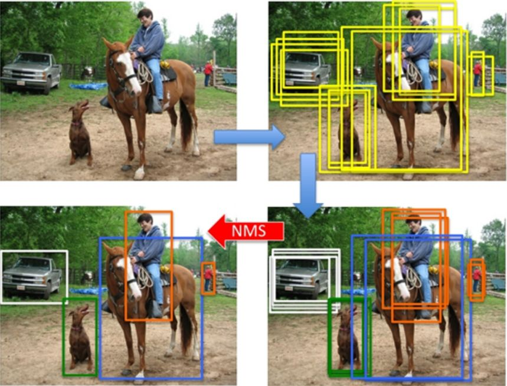

#### thermalDetect 中 rundetect function

```python
def run_inference(input_blob, exec_net, image, DETECTION_THRESHOLD_quality_decides):
    # 照片前處理：將照片resize成416*416的大小
    image_to_classify = preprocess_image(image)

    # NCS2 inference!! and get the result
    outputs = exec_net.infer(inputs={input_blob: image_to_classify}) #a dict {inputs:array(1, 3, 416, 416)} -> (1,3,13/26,13/26)

    results = post_proceesing(outputs, image, DETECTION_THRESHOLD_quality_decides) #do not use image_to_classify as input!
```


##### image_to_classify：將照片resize成416x416大小的canvas，輸出將 NHWC 格式轉成 NCHW 格式

* input：image

* output：nparray (1,3,416,416)=(N,C,H,W)


##### outputs：輸入NCS2推論引擎，輸出為dict

* input：{ "input":image_to_classify } { "str":(1,3,416,416) }

* output：{神經網路名稱:DetectionObject} {output layer name:(1,36,13/26,13/26)}
* 神經網路名稱:
detector/yolo-v3-tiny/Conv_12/BiasAdd/YoloRegion (1,36,26,26)
detector/yolo-v3-tiny/Conv_9/BiasAdd/YoloRegion  (1,36,13,13)
* Kernel數量：
36 = 3(RGB,一個grid cell包含3個bbox) *（4 (bbox_position)+1 (confidence)+7 (class)）
* YOLOV3共進行 13x13x3 + 26x26x3 = 2535個預測結果(bbox個數)


---

##### results = post_proceesing() 處理預測出來的bbox，合併成一個結果後隨時間加入到results
* ParseYOLOV3Output(...)
* IntersectionOverUnion(...)

* input:
detector/yolo-v3-tiny/Conv_12/BiasAdd/YoloRegion (1,36,26,26)
detector/yolo-v3-tiny/Conv_9/BiasAdd/YoloRegion  (1,36,13,13)
* output:
result [box1,box2,...boxn]
(box [bbox,confidence,obj_id,track_id=0])


##### ParseYOLOV3Output:透過offset公式計算(預測)得到bbox大小與可信度
DetectionObject：
(x,y,h,w,class,confidence(probility),h_scale(原始圖片h / 416),w_scale(原始圖片w / 416))


##### IntersectionOverUnion:將最高分數的bbox計算與其他圖片overlap的程度，不斷iteration去除超過IOU域值的bbox




#### yolofast tf-test.py

```python
## main ##
start = time.time()

for i in range(1):
    img_path = "001.jpg"
    #img_path = str(i+1)+".jpg"
    img = cv2.imread(img_path)
    img = cv2.cvtColor(img, cv2.COLOR_BGR2RGB)
    img_shape = img.shape[:-1]  # height, width
    #resize = (320,320)
    img_resize = cv2.resize(img, model_image_size)
    # 正規化 0~255
    img_bn = img_resize / 255
    img_bn = img_bn.astype("float32")
    input_data = np.expand_dims(img_bn, axis=0)
    # (1,320,320,3) image_to_classify
    print("input_data",input_data.shape)
#-------------------------------------------------------------
    # YoloFastest object
    yolo_fastest = YoloFastest(tflite_path)
    yolo_output = yolo_fastest(input_data)
    #print("yolo_output",yolo_output)
    # (1,10,10,36) , (1,20,20,36) outputs
    print("yolo_output[0].shape:",yolo_output[0].shape)
    print("yolo_output[1].shape:",yolo_output[1].shape)
#------------------------------------------------------------
    # (1500,12) [box_xy, box_wh, objectness, class_scores], axis=-1
    predictions_bn = yolo3_decode(yolo_output, anchors, num_classes, model_image_size, elim_grid_sense)
    print("predictions_bn",predictions_bn.shape)

    confidence, iou_threshold = 0.5, 0.4
    boxes, classes, scores = yolo_handle_predictions(predictions_bn, img_shape,
                                                     confidence=confidence,
                                                     iou_threshold=iou_threshold)
    # results box [bbox,confidence,obj_id,track_id=0]
    #print("boxes:, classes:, scores:",boxes, classes, scores)
    #boxes = [x,y,w,h] ,classes = [第幾個class] ,score = [Max(Pr(connfidence)*Pr(classprob))]

    # boxes -> boxes_real
    boxes_real = yolo_adjust_boxes(boxes, img_shape)

    class_names = get_classes(classes_path)
    colors = get_colors(class_names)

    img_copy = img.copy()
    image_array = draw_boxes(img_copy, boxes_real, classes, scores, class_names, colors)
    img_rgb = image_array[:,:,::-1]
    write_name= "ok_"+str(i+1)+".jpg"
    cv2.imwrite(write_name,img_rgb)


end = time.time()
```
yolofast => yolov3-tiny

##### 71~83 input_data => image_to_classify
(1,320,320,3) / (1,3,416,416)

##### 85~91 yolo_output => outputs
[(1,10,10,36) , (1,20,20,36)] /  { conv12:(1,36,13,13),{ conv9:(1,36,26,26) } }

##### 93~109 boxes, classes, scores / result [box1,box2,...boxn]
box [bbox,confidence,obj_id,track_id=0]

#### 比較
|      |yolov3-tiny(原)|yolofast|
|------|-------|--------|
|input             |image| image|
|pre-process     | (1,320,320,3)  | (1,3,416,416)   
|yolo parse output   |{ { conv12:(1,36,13,13),<br> conv9:(1,36,26,26) } }   | [(1,10,10,36) , (1,20,20,36)]   |
|post-process | boxes, classes, scores  | result [box1,box2,...boxn]<br> box [bbox,confidence,obj_id,track_id=0]    |

#### 總結
兩者輸入相同，過程中輸出不太相同，最終輸出稍微不同

將輸出稍微修改一下shape以及parameter應可置換成yolofast
