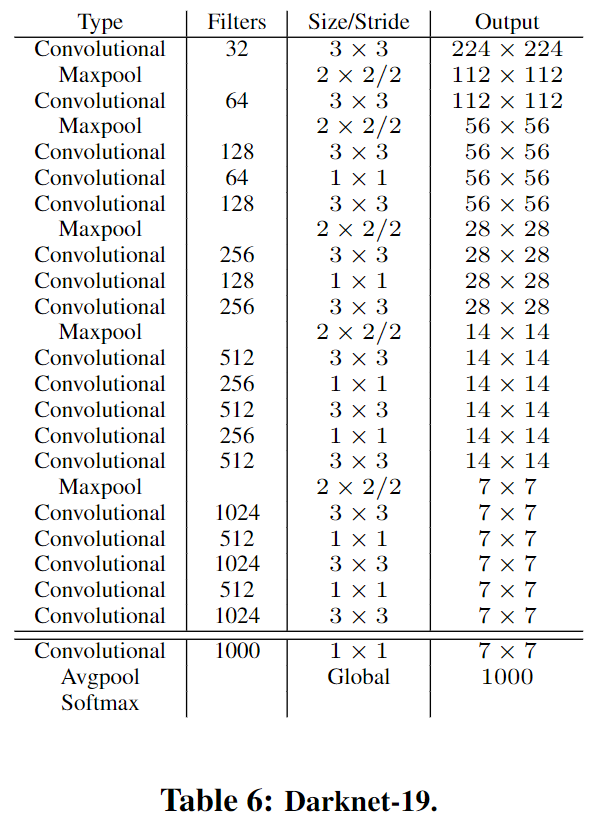
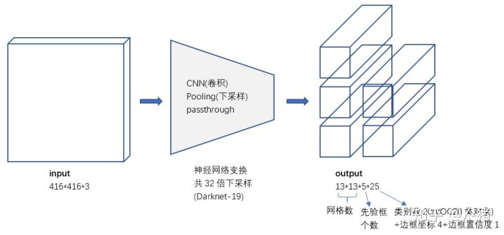

### yolov2 / yolo9000

YOLOv2 model 相比 v1 版本，在保持處理速度的基礎上，從預測更準確（Better），速度更快（Faster），辨識更多的物件（Stronger）這三個方面進行改進，其中yolo9000能夠辨識更多的物件，與yolov2使用相同的核心演算法，與其他dataset進行聯合訓練，可以辨識9000多個種類，為當時最先進的實時物件偵測系統。

yolov2使用 coco dataset 進行訓練，可以辨識80個種類； yolo9000 使用 coco + ImageNet dataset 進行訓練，可以辨識9000多個種類。

---
## 預測更準確（Better）
論文中給出了下面的改進項目列表，列出各項改進對mAP的提升效果。

### Batch Normalization (批次正規化，BN)

BN 讓模型的收斂性有了顯著的提升，同時消除對其它形式 (forms) 的正規化需求，在mAP上得到2%以上的改善。

BN 有助於模型的正規化，同時可以移除掉 dropout 層而不會 overfitting。

效果：BN 使 mAP 有2.4%的提升。

### High Resolution Classifier (高解析度分類)

所有最新的偵測方法都使用ImageNet上預訓練的分類器，從AlexNet開始，多數的分類器處理的都是小於 256x256 的輸入圖片。

* YOLOv1 在 224x224 的解析度上訓練分類器，偵測時將解析度提高到 448x448 作為輸入圖片樣本。這意味著網路必須同時切換並調整為新的輸入解析度，但這樣切換對模型性能有一定影響。

* YOLOv2 在 ImageNet 上採用 224*224 圖片進行分類模型預訓練後，再採用 448x448 的解析度使用 10 個 epochs 來微調網路，使網絡特徵逐漸適應 448x448 的解析度。然後再使用 448x448 的偵測樣本進行訓練，緩解了解析度突然切換造成的影響。接著在偵測任務上微調上面得到的網路。

效果：mAP提升了3.7% (mAP增加接近4%)。

### Convolutional With Anchor Boxes (採用候選框進行卷積)

* 輸入影像縮小為 416x416，使feature map內的位置數量是奇數，因此只會有一個中心單元。

* 卷積層將會影像降低取樣 (downsamples) 32倍，因此使用 416x416 的輸入影像會得到 feature map 13x13 的輸出

比照Faster RCNN的做法，YOLO2也嘗試採用先驗框（anchor）。在每個grid預先設定一組不同大小和寬高比的邊框，來覆蓋整個圖像的不同位置和多種尺度，這些 anchor 作為預先定義的候選區，在神經網絡中將檢測其中是否存在物件(objectness)，以及微調邊框的位置。

同時YOLO2移除了全連接層，另外去掉了一個池化層，使網絡卷積層輸出具有更高的解析度。

* YOLOv1 並沒有採用 anchor ，並且每個grid只預測 2 個 bounding box，YOLOv1一張圖片只預測98個 boxes

* YOLOv2 預測超過1000個 boxes ，所以相對YOLO1的81%的recall率，YOLO2的recall率大幅提升到88%。同時mAP有0.2%的輕微下降。

效果：recall率大幅提升到88%，同時mAP輕微下降0.2%。

(recall:資料中的「所有目標」但「正確分類為目標」的比例)

### Dimension Clusters

YOLOv1 上使用的 anchor boxes 是手工挑選的，YOLOv2上使用 k-means Clustering 自動找出好的 priors ，這些 priors 能夠得到好的IOU分數，以便尋找盡可能匹配樣本的邊框尺寸

k-means 演算法最重要的是選擇如何計算兩個邊框之間的「距離」，對於常用的歐式距離，大邊框會產生更大的誤差，YOLO2在 k-means Clustering 採用以下公式來計算兩個邊框之間的距離：

$d$ (box, centroid) = 1 − IOU (box, centroid)

* centroid 是 k-means Clustering 時被選作中心的邊框
* box 就是其它邊框
* $d$ 就是兩者間的距離
* IOU越大，距離越近；IOU越小，距離越遠

YOLO2給出的 k-means Clustering 分析結果如下圖所示：

Table 1:
使用K-means Clustering 挑選出的 anchor boxes 的結果顯示，可以得到比手工挑選先驗更好的結果

### Direct location prediction (直接預測座標)
YOLOv2調整了預測公式，將預測邊框的中心約束在特定gird網格內

$b_x = \sigma(t_x)+c_x$  
$b_y = \sigma(t_y)+c_y$  
$b_w = p_w e^{t_w}$  
$b_h = p_h e^{t_h}$  
$Pr(object) *IOU(b,object)=\sigma(t_0)$  

* $t_x,t_y,t_w,t_h,t_0$ 為每個邊界框預測5個座標，同時也是需要學習的參數  
* $σ$是sigmoid函數，將值收斂於0~1之間  
* $b_x,b_y,b_w,b_h$ 是預測邊框的中心和寬高  
* $c_x,c_y$ 是目前網格左上角到圖片左上角的距離
* $p_x,p_y$ 是anchor boxes的寬和高
* $Pr(object) *IOU(b,object)=\sigma(t_0)$ 是預測邊框的可信度  

參考上圖，由於σ函數將 $t_x,t_y$ 約束在 $(0,1)$ 範圍內，所以根據上面的計算公式，預測邊框的藍色中心點被約束在藍色背景的網格內。約束邊框位置使得模型更容易學習，且預測更為穩定。

### Fine-Grained Features (微調細粒特徵)
YOLO2引入passthrough層，在特徵圖中保留一些細節，在最後一個pooling之前，特徵圖的大小是26x26x512，將其一拆分4份。

passthrough 、 pooling + Convolution 兩者疊加到一起作為輸出的特徵圖片。

* 看一下passthrough層。圖中第25層route 16，意思是來自16層的output，即26x26x512，這是passthrough層的來源（細粒度特徵）
* 第26層1x1卷積降低通道數，從512降低到64（這一點論文在討論passthrough的時候沒有提到），輸出26x26x64。
* 第27層進行拆分（passthrough層）操作，1拆4分成13x13x256。
* 第28層疊加27層和24層的輸出，得到13x13x1280。後面再經過3x3卷積和1x1卷積，最後輸出13x13x125。

### Multi-Scale Training (圖片多尺度訓練)

* 訓練時每10個batch就隨機更換圖片尺寸大小，使網絡能夠適應不同解析度的物件偵測，在較小的解析度下網路可以執行的更快。

* 因為整個網絡降低取樣32倍，作者採用了{320,352,...,608}等10種輸入圖像的尺寸，最小的選項是320x320，最大是608x608，

---

## 速度更快（Faster）

* 為了進一步提升速度，YOLO2提出了 Darknet-19（有 19 個 Convolution layer 和 5 個 MaxPooling layer ）網絡結構。

* DarkNet-19 比 VGG-16 小一些，精度不弱於 VGG-16 ，但浮點運算量減少到約 1/5 ，以保證更快的運算速度。

### yolov2架構

##### DarkNet-19

* YOLO2的訓練主要包括三個階段。第一階段就是先在ImageNet分類數據集上預訓練Darknet-19，此時模型輸入為224*224 ，共訓練160個epochs。

##### Training for classification

* 第二階段將網絡的輸入調整為 448x448 ，繼續在ImageNet數據集上finetune分類模型，訓練10個epochs，此時分類模型的top-1準確度為76.5%，而top-5準確度為93.3%。

##### Training for detection

* 第三個階段就是修改Darknet-19分類模型為偵測模型，移除最後一個卷積層、global avgpooling層以及softmax層，並且新增了三個 13x13x1024 卷積層，同時增加了一個passthrough層，最後使用 1*1 卷積層輸出預測結果

* 輸出的 channels 數為：num_anchors*(5+num_classes)，和訓練採用的資料集有關係。由於anchors數=5，對於VOC數據集（20 classes）輸出的 channels 數就是125

* 最終的預測矩陣 T 的shape為(batch_size, 13, 13, 125)，可以先將其reshape為(batch_size, 13, 13, 5, 25)
  - T[:, :, :, :, 0:4] 為邊界框的位置和大小 ( $t_x,t_y,t_w,t_h$ )  
  - T[:, :, :, :, 4] 為邊界框的可信度 ( $σ(t_0)$ )
  - T[:, :, :, :, 5:] 為類別預測值。

##### 偵測框架精度比較 on COCO test-dev2015

##### 偵測框架精度與速度比較 on PASCAL VOC 2007

---
### 辨識更多物件（Stronger）/ YOLO9000

YOLO2嘗試利用ImageNet非常大量的分類樣本，聯合COCO的物件偵測資料集一起訓練，使得YOLO2即使沒有學過很多物件的偵測樣本，也能偵測出這些物件。

##### 建立WordTree

YOLO2於是根據WordNet，將ImageNet和COCO中的物件一起建立了一個WordTree，以physical object為root節點，各名詞依據相互間的關係構建樹枝、樹葉，節點間的連接表達了物件概念之間的蘊含關係（上位/下位關係），是一種多標籤分類模型。

* 整個WordTree中的物件之間不是互斥的關係，但對於單個節點，屬於它的所有子節點之間是互斥關係 (橫排)。

* 計算上可以進行softmax計算。上面圖10只畫出了3個softmax作為示意，實際中每個節點下的所有子節點都會進行softmax計算。

##### Wordtree建立步驟

1. 檢查每一個將用於訓練和測試的ImageNet和COCO對象，在WordNet中找到對應的節點，如果該節點到WordTree根節點（physical object）的路徑只有一條（大部分物件都只有一條路徑），就將該路徑添加到WordTree。

2. 經過上面操作後，剩下的是存在多條路徑的物件。對每個物件，檢查其額外路徑長度（將其添加到已有的WordTree中所需的路徑長度），選擇最短的路徑添加到WordTree。這樣就建立好了整個WordTree。
