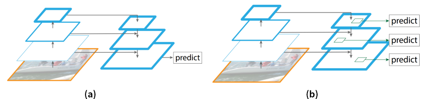

### FPN: 一種高效的CNN特徵提取方法

FPN是一種利用CNN模型來高效提取圖片中多維度(multi-scale)特徵的方法。

* 多維度的物件偵測一直以來都是通過將縮小或放大後的不同維度圖片作為輸入來生成出反映不同維度訊息的特徵組合。

* 影像金字塔(image pyramid)一直都是解決不同尺度的問題時常用的手段，不過該方法無論在時間或空間上效率都不是很好。

### 方法演進

在這篇論文中，首先就列出四種運用影像金字塔概念的方式，藍色的框框代表的就是feature map，不過框線的粗細代表著feature map特徵的級別，越粗者代表其特徵含意的層級越高。

##### ( a ) Feature Image Pyramid
* 即對某一輸入圖片通過縮小或放大從而形成不同維度的圖片作為模型輸入，使用同一模型對這些不同維度的圖片分別預測，最終再將這些分別得到的特徵（feature maps）組合起來就得到可反映多維度訊息的特徵集合。

* 此方法缺點在於需要對同一圖片在更改維度後輸入處理多次，因此對硬體的算力及記憶體大小都有較高要求。

##### ( b ) Single Feature Map
* 只拿單一維度的圖片做為輸入，然後經CNN模型處理後，拿最後一層的feature maps作為最終的特徵集合。此種方法只能得到單一維度的訊息。

* 優點是計算簡單，對硬體算力及記憶體大小都無過高需求。

* 此方法為大多數R-CNN系列物件偵測方法所用像R-CNN/Fast-RCNN/Faster-RCNN等。因此最終這些模型對小維度的目標檢測性能不是很好。

##### ( c ) Pyramidal Feature Hierarchy
* 將CNN進行卷積和降維過程中所產出的不同尺度的feature map用來做預測，然後將這些不同level的特徵合併起來，用於最終的特徵組合輸出。類似原本的影像金字塔產生Featurized Image Pyramid的機制，被稱作Pyramidal Feature Hierarchy。

* 而SSD網路是首先實現這種架構的網路。但SSD沒有使用到更前面較高解析度的feature maps(Conv2/Conv3)。

* 這些高解析度的feature maps對於小物體的檢測至關重要。雖然這樣的設計並不會使得工作量大量增加且考慮到的feature maps較多元，但是對更小維度的物件偵測效果不好。

##### ( d )Feature Pyramid Network (FPN)
* 拿單一維度的圖片作為輸入，然後它會選取所有層的特徵之後再聯合處理做為最終的特徵輸出組合。

* 充分利用CNN一路產生出知各階段的feature maps，又要讓金字塔中的每一個feature maps都有很強的特徵含意存在。

##### FPN 結構
* 為了使得不同尺度的特徵都包含豐富的語義訊息，同時又不使得計算成本過高，作者就採用top down和lateral connection(橫向連接)的方式，讓low level高解析度低語義的特徵和high level低解析度高語義的特徵融合在一起，最終得到的不同尺度的特徵圖都有豐富的語義訊息。

##### 更具體的FPN結構

* 尺寸較小的feature map (P2)會先簡單的upsampling放大尺寸兩倍，就會與上一層feature map(C1)一樣size。

* 而C1會先經過1x1的conv.將深度調整成和P2一樣，再和P2做element-wise的相加。且在相加之後，會再通過3x3 conv.，消除掉upsampling的副作用後，才作為最終要使用的feature map。
