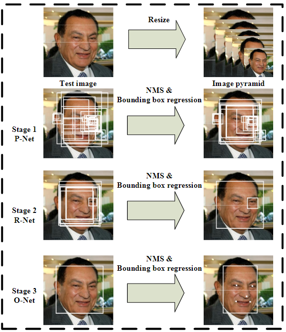
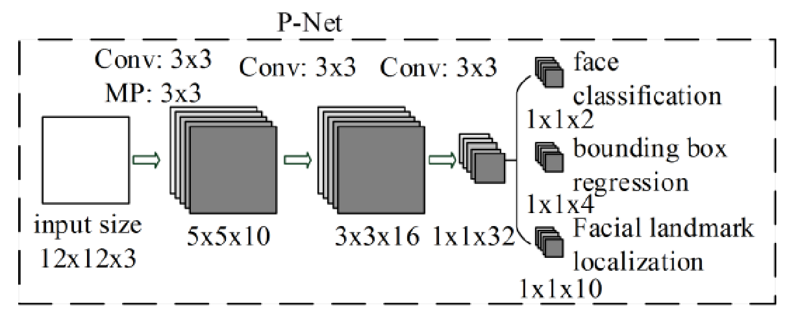
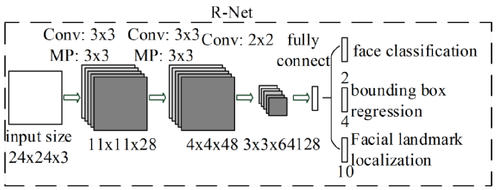
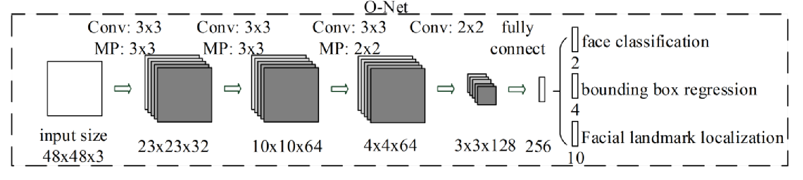
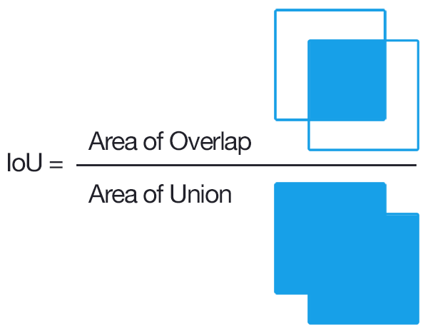
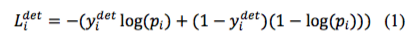
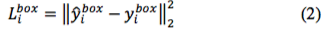
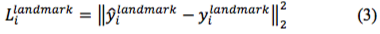
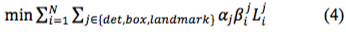

MTCNN （Multi-task Cascaded Convolutional Networks）
---
* 可以實現人臉偵測( Face Detection )與人臉對齊( Alignment )
* 透過 3 階段的 CNN ( P-net、R-net、O-net )完成人臉/非人臉判定、人臉框迴歸( bounding box regression )、特徵點( landmark )定位。
* 輸出人臉的Bounding Box以及人臉的特徵點（左眼、右眼、鼻子、左嘴角、右嘴角）位置。
* MTCNN又好又快，提出時在FDDB、WIDER FACE和AFLW dataset上取得了當時（2016年4月）最好的結果，後來被InsightFace和facenet採用。
* [MTCNN][1]

  [1]: https://arxiv.org/ftp/arxiv/papers/1604/1604.02878.pdf        "游標顯示"
### 網路結構

##### Pipeline

* 對輸入圖片建立圖像金字塔(image pyramid)，使網路適應不同尺度(multi scale)的人臉，通過cascade CNN完成對人臉由粗到細（coarse-to-fine）的偵測。
* P-Net -> R-Net -> O-Net 網路層數逐漸加深，輸入圖像的尺寸（感受視野）在逐漸變大(12→24→48)，最終輸出的特徵維數也在增加(32→128→256)，意味著利用的訊息越來越多。

##### Stage 1. Proposal Network (P-Net)
* 全卷積神經網絡(FCN)
* 生成候選框(Bounding box)和框迴歸向量(bounding box regression vectors)， 以框回歸向量去校正候選框。
* 判斷每個位置約12 × 12大小的區域內是否包含人臉，如果包含人臉，則回歸出人臉的Bounding Box。
* 最後用NMS(non-maximum suppression)保留分數最高的Bounding box以及移除重疊區域過大的Bounding Box。

>候選框：可能包含人臉的Bounding Box  
>NMS：預測結果與ground-truth的重合度(IOU)大於某個閾值時，去除掉機率低的bbox

##### Stage 2. Refine Network (R-Net)
* 單純的捲積神經網絡(CNN)
* 將 P-net 篩選出來的候選框作為 R-net 的輸入(24x24)，去除大量的非人臉框，細化處理目標人臉框的精度
* 利用框迴歸向量對候選視窗做校正
* 判斷是否包含人臉，如果包含人臉，也回歸出Bounding Box
* NMS保留分數最高的Bounding box以及移除重疊區域過大的Bounding Box

##### Stage 3. Output network (O-net)
* 單純的捲積神經網絡(CNN)
* 將 R-net 篩選出來的候選框作為 O-net 的輸入(48x48)，去除大量的非人臉框，細化處理目標人臉框的精度
* 進行人臉偵測和取得特徵點
* 輸出人臉5個特徵點（左眼、右眼、鼻子、左嘴角、右嘴角）坐標

##### 訓練樣本選擇
* a. 負樣本資料：IoU 小於0.3
* b. 正樣本資料：IoU 大於0.65
* c. 部分人臉資料：IoU 大於0.4 小於0.65
* d. 特徵點樣本資料：樣本標註了5個特徵點的坐標

IoU （Intersection over Union）即 bounding box 和 groud truth 的交並比，計算方法如下圖所示：

* 訓練時，負樣本和正樣本用於是否為人臉分類的訓練
* 正樣本和部分樣本用於偵測框回歸訓練
* 特徵點樣本則用於人臉特徵點的訓練。

##### 網路輸出與loss function

* face classification判斷是不是人臉，因此輸出是2維的，一個代表是人臉的機率，一個代表不是人臉的機率
* 此為分類問題，使用softmax cross-entropy(交叉熵損失)
* $y_i^{det}$ 表示ground truth label
* $P_i$ 代表為臉的機率

* bounding box regression回歸出的是bounding box左上角和右下角的偏因此是4維的向量
* 此為回歸問題，使用L2 loss function(歐幾里得損失)

* facial landmark localization回歸出的是左眼、右眼、鼻子、左嘴角、右嘴角共5個點的位置，因此是10維的向量
* 此為回歸問題，使用L2 loss function(歐幾里得損失)

* 在訓練階段，3個網絡都會將特徵點位置作為監督信號來引導網路的學習
* 在預測階段，P-Net和R-Net僅做人臉檢測，不輸出特徵點位置（因為這時人臉檢測都是不準確的），特徵點位置僅在O-Net中輸出。

最終將三個損失函數進行加權累加，便得到 total loss function，而且不是所有的樣本都同時存在上述三種損失。

* 當負樣本和正樣本訓練時，由於僅用於分類，所以其僅有分類損失($L_i^{det}$ )，而不存在人臉偵測框($L_i^{box}$ )和人臉特徵點定位損失($L_i^{landmark}$ )。
* 通過控制不同權重，使得三個網路的關注點就會不同

$\alpha$ 表示權重值
* 對於P-Net 和R-Net 則更關注 bbox 定位的準確性，landmark loss 權重較小，$\alpha_{det}=1$，$\alpha_{box}=0.5$，$\alpha_{landmark}=0.5$
* 對於O-Net則更關注landmark定位的準確性，$\alpha_{det}=1$，$\alpha_{box}=0.5$，$\alpha_{landmark}=1$

$\beta$ 表示樣本類型

* a. 當樣本為負樣本資料時，$\beta^{det}=1$，$\beta^{box}=0$，$\beta^{landmark}=0$;
* b. 當樣本為正樣本資料時，$\beta^{det}=1$，$\beta^{box}=1$，$\beta^{landmark}=0$;；
* c. 當樣本為部分人臉資料時，$\beta^{det}=0$，$\beta^{box}=1$，$\beta^{landmark}=0$;;
* d. 當樣本為特徵點樣本資料時，$\beta^{det}=0$，$\beta^{box}=0$，$\beta^{landmark}=1$;
