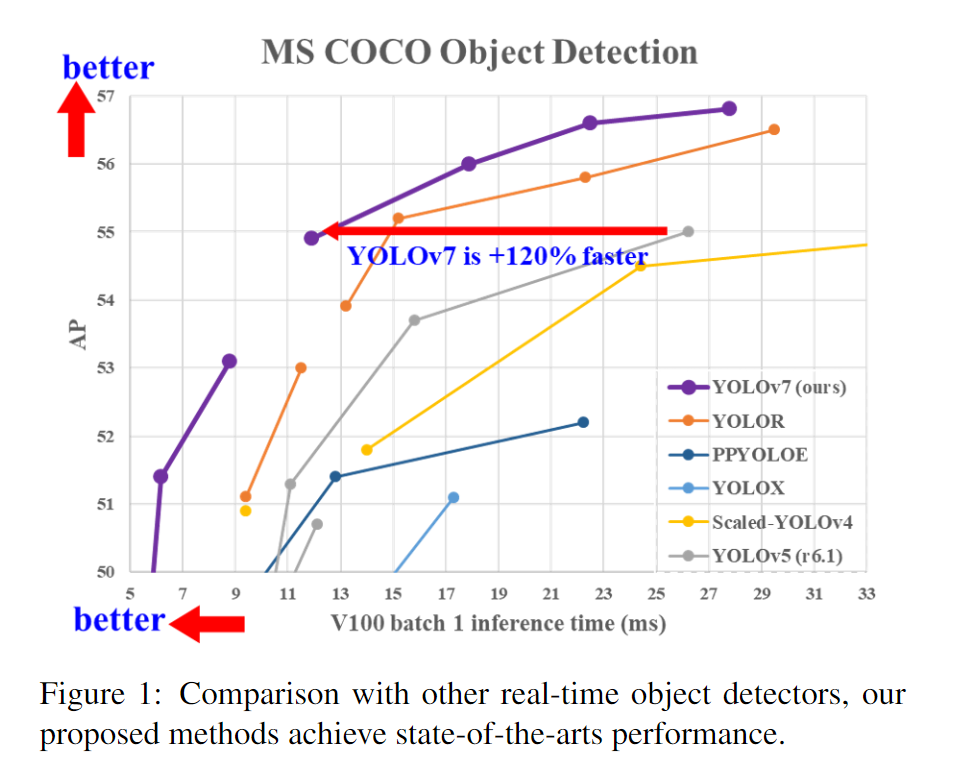

##### yolov7

##### introduction
* YOLOv7 在 5 FPS ~ 160 FPS 範圍內，速度和精度都超過了所有已知的目標檢測器，並在GPU V100 上，30 FPS 的情況下達到real time object detector 的最高精度 (56.8% AP)。
* YOLOv7 是在 MS COCO 數據集上從頭開始訓練的，不使用任何其他dataset或pre-trained weights。
* YOLOv7 的在速度和精度上的表現也優於YOLOR、YOLOX、Scaled-YOLOv4、YOLOv5、DETR 等多種object detector。

YOLOv7 的發展方向與當前主流的實時目標檢測器不同，研究團隊希望它能夠同時支援 mobile GPU 和從邊緣到雲端的 GPU device。

除了架構優化之外，該研究提出的方法還專注於訓練過程的最佳化，將重點放在了一些最佳化模組和最佳化方法上。

* YOLOv7設計出bag-of-freebies方法增加detection的準確度而且不須額外增加推論成本
* 使用 re-parameterized 模組替換掉原來的模組，以及使用dynamic label assignment 處理不同輸出層的分配問題。
