# MobileNet V1

* 當時CNN在CV領域越來越流行，為了達到提高準確率需要做更深更複雜的model
* 但網路越深，發生gradient vanishing(梯度消失)以及gradient exploding(梯度爆炸)的機率越高，造成梯度不更新
* ResNet透過residual learning(殘差學習)使其能夠訓練更深的模型並提升準確度，但運算時相當耗資源(MobileNet有參考此結構)
* MobileNet為efficient model(net)的代表作，應用於mobile(可攜式)以及嵌入式(embedded)視覺應用

[MobileNetV1](https://arxiv.org/abs/1704.04861)

### Depthwise Separable Convolution(深度可分離卷積)
* MobileNet基於Depthwise Separable Convolution，其中這種結構最早出現在GoogleNet v3的InceptionNet中
* 將標準卷積拆分為深度卷積(depthwise convolution)和逐點卷積(pointwise convolution)兩個操作
* 對每個input channel採用不同的kernel，就是說一個kernel對應一個input channel，所以說depthwise convolution對depth做操作

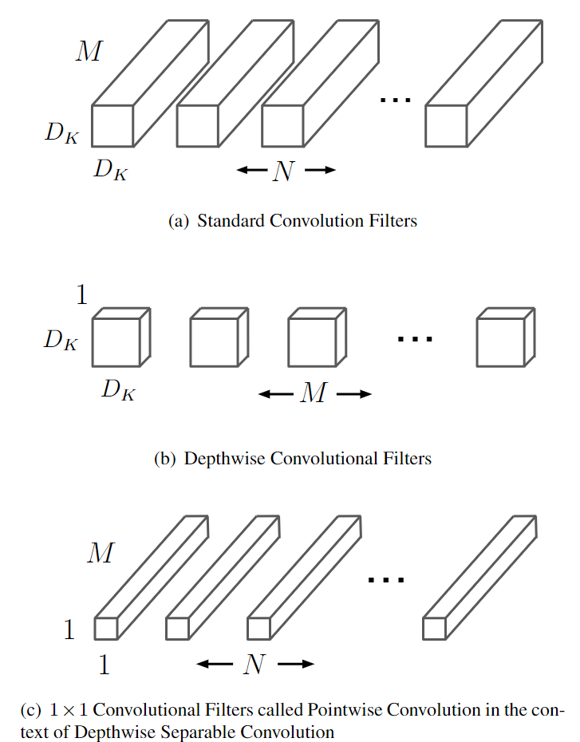

##### 分析：
##### 採用standard convolution

* input size為$D_F$ x $D_F$ x $M$
* standard kernel size為$D_K$ x $D_K$ x $M$ x $N$($N$ 個$D_K$ x $D_K$ x $M$的kernel)

$M$ 是 input channels 的數量  
$N$ 是 output channels 的數量  
$D_F$ 是 input feature map 的大小  
$D_K$ 是 kernel 的大小

* 採用standard kernel進行卷積，Stride=1且padding=same，輸出尺寸為$D_F$ x $D_F$ x $N$，計算量為$D_K$ x $D_K$ x $M$ x $N$ x $D_F$ x $D_F$

---

##### 採用depthwise separable convolution與1×1 convolution (pointwise convolution)

* 對於 Input 中的每層 channel(depth) 各自單獨做卷積
* 先使用 $M$ 個Depthwise Convolutional Filter對輸入的$M$個channel分別進行卷積，得到尺寸為$D_F$ x $D_F$ x $M$，這一步的計算量為$D_K$ x $D_K$ x $M$ x $D_F$ x $D_F$；
* 再使用 $N$ 個$1$ x $1$ x $M$的kernel進行逐點卷積得到輸出尺寸為$D_F$ x $D_F$ x $M$ x $N$，這一步的計算量為$M$ x $N$ x $D_F$ x $D_F$
* 故總的計算量為$D_K$ x $D_K$ x $M$ x $D_F$ x $D_F$ + $M$ x $N$ x $D_F$ x $D_F$

兩種方法計算量相比，通常N的取值較大可忽略，如果kernel size = 3 x 3，後者可以減少9倍運算量

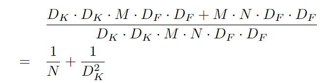

#### 舉例：

##### 傳統卷積：
* 假設input 的尺寸為 32 * 32 * 2 的照片，透過傳統的 Convolution 使得其輸出為一個尺寸為 32 * 32 * 3 的 feature map
* 而為了達到這個目的 kernel size 為 K * K * 2 * 3 (3 個 K * K * 2 的 kernel)，而每個 kernel 對input 做完 convolution 之後會得到 output 的一層 channel feature map，如下圖：

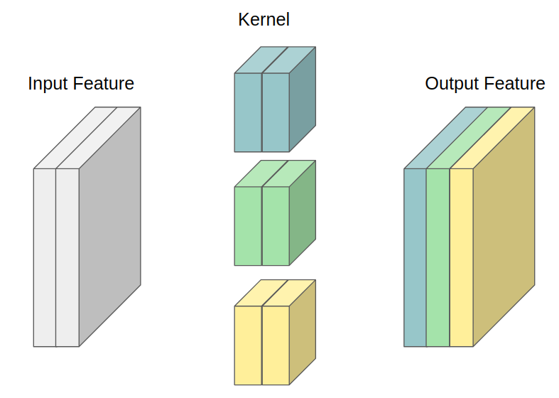

##### depthwise separable convolution：

* 對於 Input 中的每層 channel(depth) 各自做 Convolution，
32 * 32 * 2 的 Input，切割成了兩個 32 * 32 * 1的 Input，切割之後原先我們尺寸為 K * K * 2 的 Kernel 可以簡化為 K * K * 1的尺寸

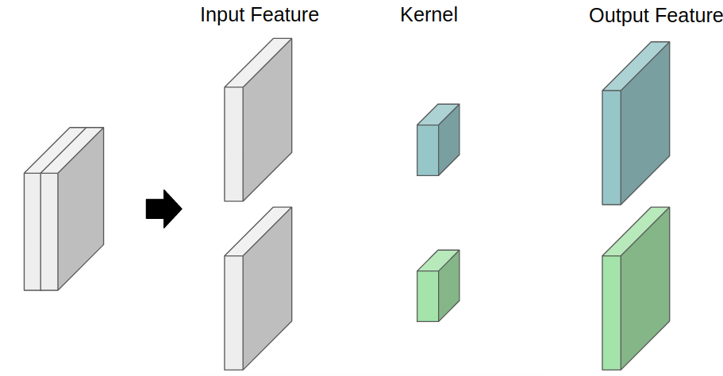

##### 1×1 convolution (pointwise convolution)：

* 經過 Depthwise convolution 的 output feature map 32 * 32 * 2，我們利用了 3 個 1 * 1 * 2 的 kernel 進行 convolution 後可以得到一個尺寸為 32 * 32 * 3 的 output feature map

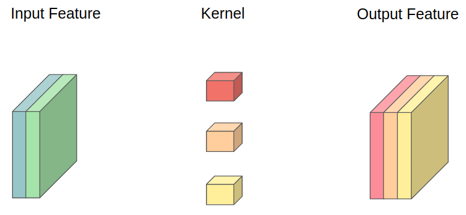

##### 運算量比較

假設$D_k=K,M=2,N=3,D_F=32$  

>$D_k$ : kernel 的大小 (e.g., K)  
>$M$ : Input(Feature map F) 的 channel 數量 (e.g., 2)   
>$N$ : Output(Feature map G) 的 channel 數量 (e.g., 3)  
>$D_F$ : Output feature 的大小 (e.g., 32)  

傳統卷積： 

$D_K$ x $D_K$ x $M$ x $N$ x $D_F$ x $D_F$

$=K * K * 2 * 3 * 32 * 32 = 6144 * K^2$

depthwise separable convolution： 

$D_K$ x $D_K$ x $M$ x $D_F$ x $D_F$ + $M$ x $N$ x $D_F$ x $D_F$

$=K * K * 2 * 32 * 32 + 3 * 2 * 32 * 32 = 2048 * K^2 + 6144$

可以發現相比傳統方法減少了大量的運算量

### 網絡結構和訓練

與標準卷積結構相比多加了Depthwise 、 BN以及ReLU layer

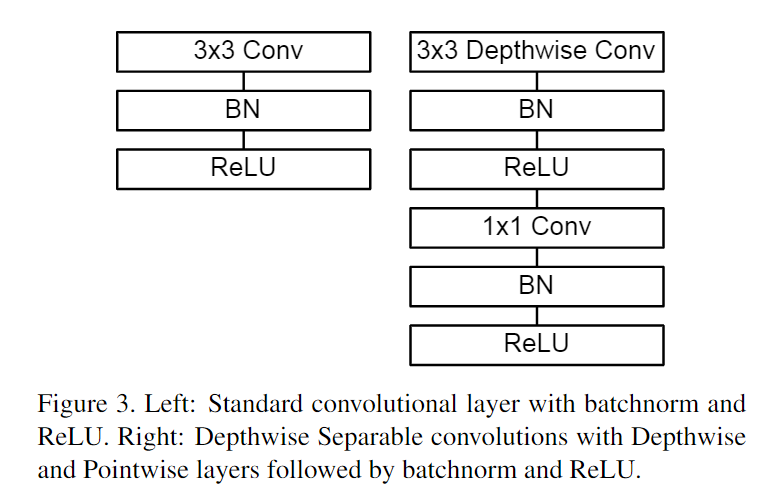

MobileNet除了第一層採用的是標準卷積核之外，剩下的捲積層都用的是Depth wise Separable Convolution

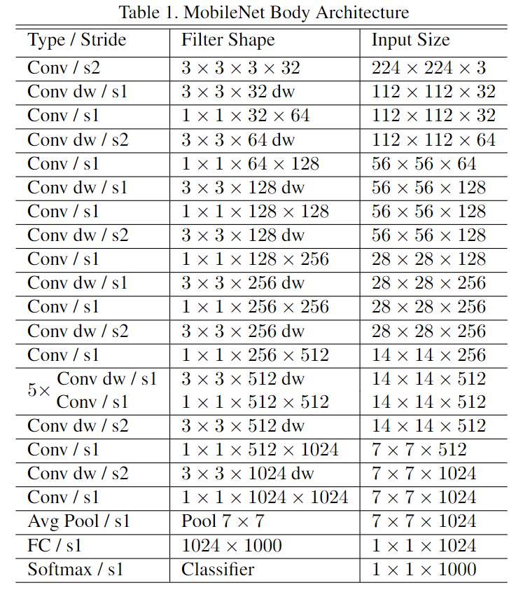

* 矩陣乘法一般是使用 GEMM (General Matrix Multiply Functions) 的方法進行計算，但是在進行卷積前要先使用im2col的方法對原來的Kernel和輸入重新進行排序才可以進行矩陣乘法
* 如果使用 1 x 1 的Kernel就不需要重新排序
* MobileNet花費在計算上的時間佔了 95% 和 74.59% 的 parameter 集中在 1 x 1 的捲積層上，而且幾乎另外的參數也都在全連接層(FC)上

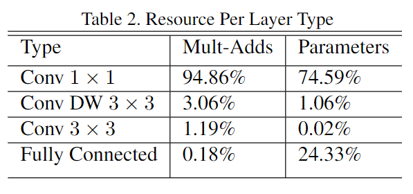

##### Width Multiplier：寬度變薄

* 雖然 MobileNet 網路結構和延遲與傳統方法比變得更小，但在特定應用下還是需要更小更快的模型
* 為此引入寬度因子 $α$ 對每一層輸入通道數(input channel)進行縮減，$M$ -> $α * M$，$N$ -> $α * N$
* 變換後的計算量為  
$D_K * D_K * α * M * D_F * D_F + α * M * α * N * D_F * D_F$

##### Resolution Multiplier：控制模型大小

* 第二個控制模型大小的超參數是：解析度因子 ρ(resolution multiplier)，用於控制 input 和內部 layer，即用解析度因子控制input的解析度
* depthwise convolution和逐點卷積的計算量： 
$D_K * D_K * α * M * ρ * D_F * ρ * D_F + α * M * α * N * ρ * D_F * ρ * D_F$
* ρ介於0~1之間(ρ ∈ (0,1])，$ρ$ = 1 是 MobileNet 的 baseline，$ρ$ 設定 < 1 的值可以再減少 MobileNet 的計算量，解析度因子有著 $ρ^2$ 的影響
* 典型的輸入解析度為224、192、160、128

傳統CNN、Depthwise、調整 $α$ 以及 $ρ$ 對計算時間以及參數的影響，$D_K = 3, M = 512, N = 512, D_F = 14$

>feature map size：14x14x512  
>Kernel K size：3x3x512x512  

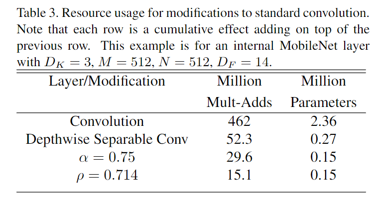

### 實驗

ImageNet 的表現上，相比於 GoogleNet 以及 VGG16 ， MobilenetV1 可以在差不多的準確度的情況下，大幅的降低運算量以及參數量

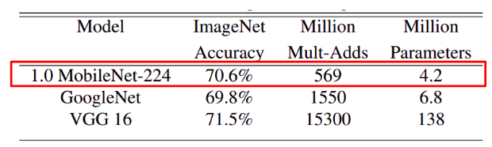

調整解析度的影響較小，調整寬度影響較大。

> α ∈ {1,0.75,0.5,0.25}  
> resolution ∈ {224,192,160,128}  

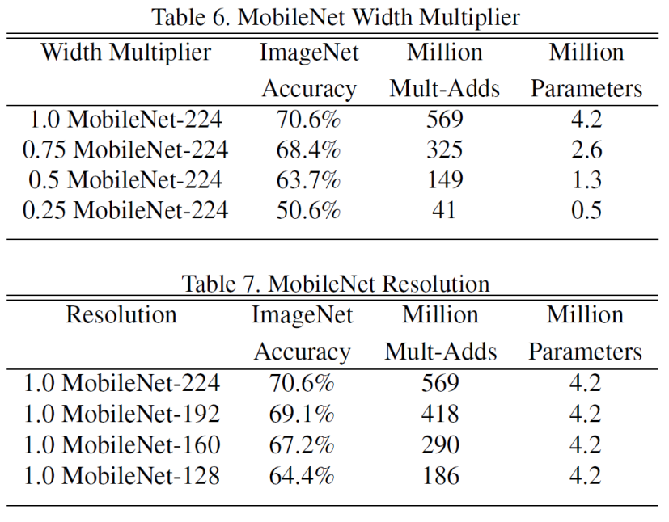

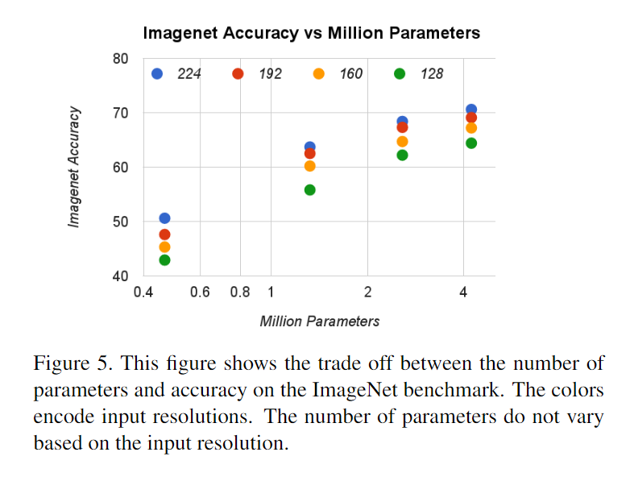

### 應用

 在 object detection 上，作者將 MobileNet 套用在 SSD、faster-RCNN 等著名的物件偵測架構上，發現 mobileNet 可以與這些物件偵測架構搭配，取得良好的準確度以及驚人的小運算量。

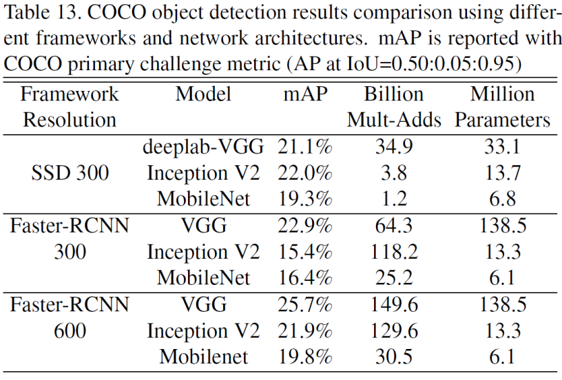

在 face recognition 的題目上，MobileNet 也可以取得很好的表現，作者利用蒸餾 (distillation) 的方法，將 MobileNet 的輸出擬和至 pretrained FaceNet 的輸出。

distillatio 的目的是讓小模型去模擬大模型，而不是直接逼近Ground Label

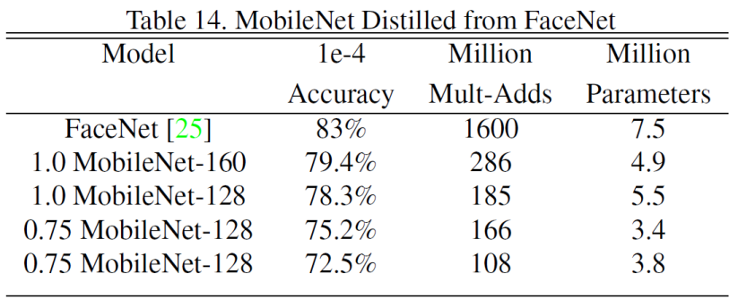

### 結論
論文提出了一種基於深度可分離卷積的新模型MobileNet，同時提出了兩個超參數用於調整成小模型於現實生活中應用。實驗部分將MobileNet與許多先進模型做對比，展現出MobileNet的在size、計算量、速度上的優越性。
